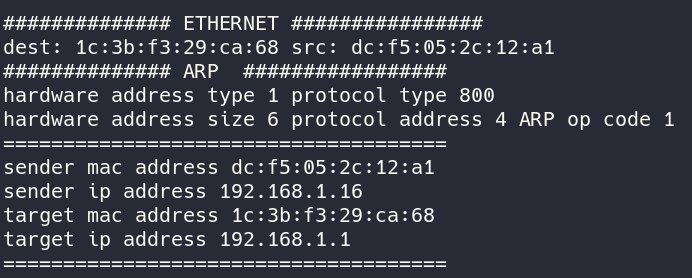
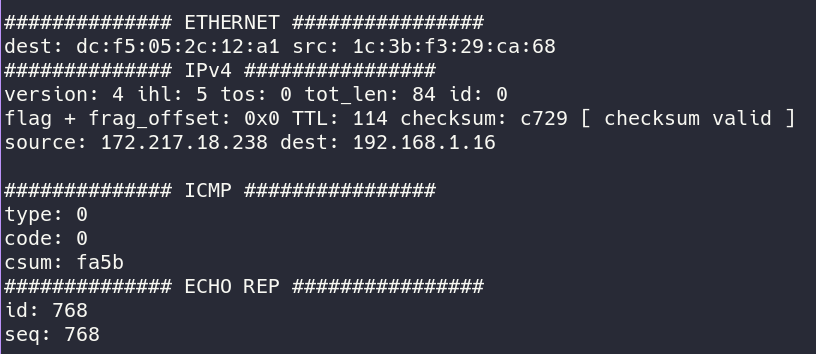
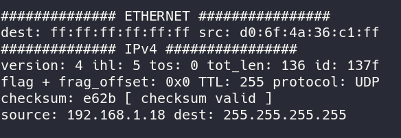

# Presentation

This is a simple packet sniffer written in c/c++ based on a tui and using raw sockets  
it also understands packet header information of various protocols ethernet,arp,ip,icmp  





# Setup
```bash
make
sudo ./sniffer
```

# Sources

https://www.opensourceforu.com/2015/03/a-guide-to-using-raw-sockets/  
https://man7.org/linux/man-pages/man7/socket.7.html  
https://squidarth.com/networking/systems/rc/2018/05/28/using-raw-sockets.html  

